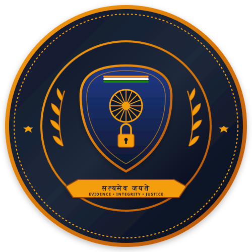
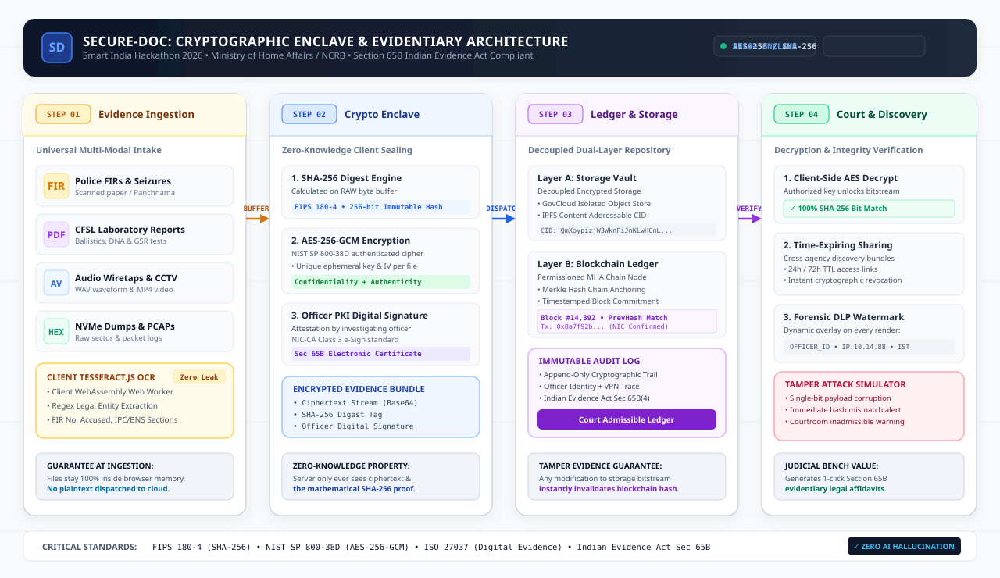
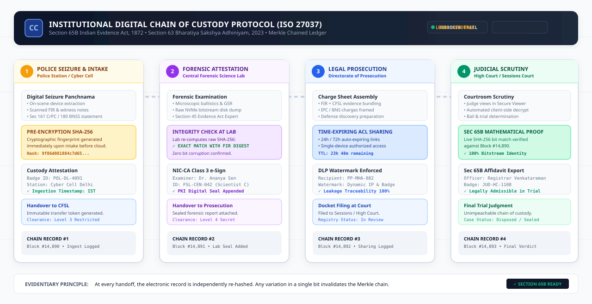

<div align="center">
  

  # Secure-Doc
  ### Secure Digital Document Management System for Legal & Investigation Documents
  
  **Smart India Hackathon 2026** • **Category:** Software • **Theme:** Blockchain & Cybersecurity  
  **Nodal Organization:** Ministry of Home Affairs • **Department:** National Crime Records Bureau (NCRB), Women Safety Division

  [](https://nextjs.org/)
  [](https://react.dev/)
  [](https://www.typescriptlang.org/)
  [](#cryptographic-standards)
  [](#legal-and-forensic-framework)
  [](#1-click-evaluator-profiles)
</div>

---

## 1. Executive Summary & Problem Statement

Throughout the criminal investigation and judicial lifecycle, Indian law enforcement agencies, public prosecutors, Central & State Forensic Laboratories (CFSL/FSL), and courts handle immense quantities of critical, classified evidentiary documents and digital media:

- **Police First Information Reports (FIRs) & Case Diaries**
- **CFSL Forensic Ballistics, DNA, GSR & Toxicology Reports**
- **Witness Statements recorded u/s 161 CrPC / Section 180 Bharatiya Nagarik Suraksha Sanhita (BNSS)**
- **Police Charge Sheets & Final Investigation Reports**
- **Judicial Trial Dockets, Bail Determinations & Case Precedents**
- **Physical & Digital Seizure Panchnamas with Hash Verification**
- **Surveillance Wiretap Audio Intercepts (WAV, MP3, AAC)**
- **CCTV Video Footage from Crime Scenes (MP4, MKV, AVI)**
- **Forensic Raw NVMe Disk Dumps & Packet Captures (PCAP, DD, E01, RAW, ZIP)**

### Critical Real-World Vulnerabilities
1. **Evidentiary Tampering & Chain-of-Custody Gaps:** Traditional file repositories and physical files provide no mathematical guarantee that evidence has not been tampered with or substituted in transit.
2. **Failure under Section 65B of the Indian Evidence Act:** Without mathematically verifiable, time-stamped proof of integrity and custody from seizure to bench, electronic records are frequently challenged or dismissed in court.
3. **Inter-Departmental Silos & Leakages:** Police, forensic analysts, prosecutors, and magistrates communicate across fragmented, insecure channels, risking premature leakage of confidential victim/witness records.
4. **Lack of Universal Ingestion & Local Inspection:** Investigators lack a zero-trust platform capable of previewing and cryptographically processing *any* evidence type (from FIR scans to audio wiretaps and raw PCAP memory dumps) directly in the officer's browser before cloud transmission.

---

## 2. Secure-Doc 4-Phase System Architecture

`Secure-Doc` solves these critical vulnerabilities via a **client-side, zero-knowledge cryptographic enclave pipeline**:

<div align="center">
  
  <p><i>Figure 1: Secure-Doc End-to-End Cryptographic Architecture — Client-Side Ingestion, Pre-Encryption Hashing (SHA-256), AES-256 Enclave Packaging, and Permissioned Blockchain Ledger Anchoring.</i></p>
</div>

### Architectural Workflow Breakdown:
1. **Multi-Modal Evidence Ingestion (Step 2):** Any evidence file (FIR image, PDF, CCTV footage, wiretap audio, or forensic disk dump) is loaded in the browser. Client-side OCR via Tesseract.js extracts key metadata (FIR numbers, sections, accused details) and normalizes the payload.
2. **Evidentiary SHA-256 Hash Generation (Step 3):** An immutable cryptographic fingerprint (FIPS 180-4 standard) is computed on the raw file buffer *prior* to any encryption.
3. **Client-Side AES-256-GCM Envelope Encryption (Step 3):** Payload is sealed using 256-bit symmetric key encryption with authenticated Galois/Counter Mode. Plaintext never leaves the officer's terminal unencrypted.
4. **Blockchain Anchoring & Storage Dispatch (Step 3):** The SHA-256 digest, NIC-CA Class 3 digital signature, and metadata are anchored into the permissioned ledger, while the cipher payload is dispatched to GovCloud storage.
5. **Decrypted Viewing & Tamper Proof (Step 4):** Authorized judicial and prosecutorial officers decrypt the stream client-side and automatically compute a live SHA-256 checksum to verify 100% bitstream integrity before courtroom presentation.

---

## 3. Institutional Digital Chain of Custody Protocol

Under Section 65B of the Indian Evidence Act, 1872 and Section 63 of Bharatiya Sakshya Adhiniyam, 2023, electronic evidence must maintain an unbroken, auditable chain-of-custody.

<div align="center">
  
  <p><i>Figure 2: Digital Evidence Lifecycle and Section 65B Indian Evidence Act Custody Chain from Police Seizure to Judicial Verdict.</i></p>
</div>

### Chain of Custody Stages:
| Stage | Responsible Agency | Operations & Guarantees |
| :--- | :--- | :--- |
| **1. Digital Seizure & FIR Ingestion** | **Police & Law Enforcement** | Officer ingests evidence at source; SHA-256 pre-encryption digest generated immediately upon intake; automated OCR indexes IPC/BNS legal provisions. |
| **2. Scientific Forensic Analysis** | **Central Forensic Science Lab (CFSL)** | Forensic examiners inspect evidence, generate ballistic/DNA certificates, sign findings with Class 3 PKI e-Sign certificates u/s 45 Evidence Act. |
| **3. Cross-Agency Discovery & ACLs** | **Public Prosecution Directorate** | Charge sheet evidence bundles shared with defense and magistrate using time-expiring (24h/72h), single-device, forensic watermarked access links. |
| **4. Judicial Scrutiny & Court Records** | **Courts & High Court Bench** | Judges open evidence docket in Secure Viewer with real-time SHA-256 bitstream match verification; Section 65B electronic certificates generated with one click. |

---

## 4. Multi-Modal Universal Evidence Ingestion Engine

`Secure-Doc` incorporates a custom-built, client-side **Universal Multi-Modal Evidence Previewer** capable of handling all categories of digital evidence without external software:

| Evidence Format | Supported Extensions | Specialized In-Browser Viewer |
| :--- | :--- | :--- |
| **Physical Document Scans** | `.png`, `.jpg`, `.jpeg`, `.webp`, `.tiff` | Deep-zoom canvas inspector with contrast enhancement & rotation controls. |
| **Judicial Dockets & Reports** | `.pdf` | Embedded multi-page PDF viewer with searchable text overlay. |
| **Crime Scene Surveillance** | `.mp4`, `.webm`, `.mov`, `.mkv` | Hardware-accelerated CCTV player with timestamped frame scrubber. |
| **Wiretaps & Intercepts** | `.mp3`, `.wav`, `.aac`, `.ogg`, `.flac` | Interactive audio player with real-time acoustic waveform visualization. |
| **Financial Ledgers & Call Records** | `.csv`, `.tsv`, `.xlsx` | High-performance interactive data table with column sort and filter. |
| **Legal Filings & Affidavits** | `.txt`, `.json`, `.xml`, `.log`, `.md` | Monospaced source inspector with line counters and search. |
| **Forensic Memory Dumps & PCAPs** | `.pcap`, `.pcapng`, `.dd`, `.raw`, `.bin`, `.zip` | Virtualized byte-level offset / hex / ASCII dump inspector. |

---

## 5. Enterprise Navigation & 9-Page Integrated GovTech Suite

`Secure-Doc` features a state-of-the-art enterprise navigation bar and 9 purpose-built pages tailored to Indian law enforcement, forensic scientists, prosecutors, and judiciary:

| Page / Module | Category | Primary Function & Statutory Role | Key Capabilities |
| :--- | :--- | :--- | :--- |
| **1. Dashboard Overview** | `Core Workflow` | Executive overview & evidentiary pipeline metrics | Live intake charts, chain-of-custody flowchart, system architecture inspector, and quick action shortcuts. |
| **2. Case Dockets Repository** | `Core Workflow` | Centralized classified investigation docket index | Multi-filter search (Police FIRs, CFSL reports, High Court orders, Charge sheets), status filters, SHA-256 copy, item count. |
| **3. Secure Upload & OCR** | `Core Workflow` | Universal client-side evidence ingestion | Drag-and-drop any media file, client-side Tesseract.js OCR, legal entity regex extraction, and AES-256 envelope encryption. |
| **4. Universal Secure Viewer** | `Core Workflow` | Zero-knowledge client-side decryption | Deep inspection of PDFs, images, CCTV video, wiretap audio, CSVs, hex dumps, plus interactive **Simulate Tamper Attack** test. |
| **5. Inter-Agency Sharing** | `Custody & Governance` | Cross-department access control lists (ACLs) | Time-bounded access tokens (24h/72h), role restriction matrices, DLP forensic watermarks, and instant token revocation. |
| **6. Immutable Audit Ledger** | `Custody & Governance` | Chronological legal evidence chain of custody | Merkle-anchored event logs, cryptographic tamper verification, and Section 65B compliance timeline. |
| **7. Cryptographic Enclave** | `Custody & Governance` | Hardware Security Module (HSM) & hash telemetry | Live drag-and-drop File Hash Calculator (SHA-256 / SHA-512 via WebCrypto), SafeNet Luna HSM diagnostics, and key rotation. |
| **8. Legal Compliance Library** | `Statutory Law` | Indian Evidence Act Sec 65B & BSA 2023 Sec 63 | Mandatory 4-condition compliance checklist, Supreme Court case law (*Arjun Khotkar*, *Anvar P.V.*), and sworn affidavit generator. |
| **9. Officer Profile & Settings** | `Officer Security` | PKI identity & workstation security parameters | Class 3 NIC-CA digital certificate thumbprint, FIPS 140-2 hardware token status, auto-lock timeouts, and session audit logs. |

### Enterprise Navigation Bar Features:
- **Global Command & Search Palette (`Ctrl+K`):** Instant search across all 1,428 case dockets, FIR numbers, forensic hashes, modules, and statutory legal sections.
- **Top Horizontal Tab Bar:** Secondary quick-jump row keeping all modules accessible with single-click navigation from any screen.
- **Live Evidentiary IST Clock:** Legal timestamp synchronized to Indian Standard Time (IST) with millisecond-accurate evidentiary ticking.
- **Interactive Notification Center:** High-priority alerts for newly sealed CFSL reports, generated Section 65B affidavits, and expiring ACL access tokens.
- **Classified Clearance Badge:** Active officer role switcher (Police, CFSL, Prosecutor, Magistrate) with instantaneous RBAC simulation.
- **Preloader Diagnostics Animation:** High-tech cryptographic enclave boot sequence with rotating official seal and live TLS handshake progress.

---

## 6. Four-Phase SIH Development Roadmap

| Phase | Module | Status | Deliverables |
| :--- | :--- | :---: | :--- |
| **Step 1** | **Authentication, RBAC & App Shell** | **Completed** | MHA/NCRB GovTech UI, Supabase & JWT session engine, 6-digit TOTP/MFA modal, 1-Click Jury Profiles, dynamic role switcher, and responsive sidebar navigation. |
| **Step 2** | **Digital Ingestion & OCR Processing** | **Completed** | Drag-and-drop universal multi-modal ingestion zone, client-side Tesseract.js OCR, legal entity regex parser (FIR No, Accused, Acts & Sections), and turnkey 1-click sample document generators. |
| **Step 3** | **Security Processing & Cryptography** | **Completed** | Client-side SHA-256 evidentiary hash generation, client-side AES-256 envelope encryption, officer PKI digital signature attestation (NIC-CA), mock IPFS GovCloud storage, and permissioned blockchain anchoring. |
| **Step 4** | **Secure Viewer, ACLs & Audit Ledger** | **Completed** | Client-side AES-256 decryption viewer with live SHA-256 hash match verification, interactive **Simulate Tamper Attack** toggle, time-expiring inter-department sharing links with DLP forensic watermarks, and Section 65B tamper-proof audit ledger with affidavit export. |

---

## 7. Institutional RBAC (Role-Based Access Control)

`Secure-Doc` enforces strict institutional role boundaries aligned with the Indian criminal justice ecosystem:

| Institutional Role | Clearance Level | Permitted Operations |
| :--- | :---: | :--- |
| **Police & Law Enforcement** | `LEVEL_3` | FIR registration, seizure panchnama ingestion, suspect indexing, initial custody logging. |
| **Judiciary & Court Registry** | `LEVEL_5` | High Court & Sessions Court docket scrutiny, bail orders, trial minutes, judicial sealing. |
| **Forensic Science Lab (CFSL)** | `LEVEL_4` | Ballistics, digital forensics, DNA profiles, expert scientific opinions u/s 45 Evidence Act. |
| **Public Prosecution & Legal** | `LEVEL_3` | Charge sheet audit, witness statement review, cross-agency evidence discovery bundles. |
| **NCRB Nodal Oversight** | `LEVEL_5` | Master cryptographic key oversight, national crime data synchronization, compliance audits. |

---

## 8. 1-Click SIH Evaluator Profiles (Instant Jury Evaluation)

For instant jury evaluation without manual signup steps, the login portal includes 4 pre-configured government officer profiles:

1. **Insp. Vikramaditya Rathore** (`POL-DL-4091`) — *Delhi Police Special Crime Division*
2. **Hon. Registrar S. Venkataraman** (`JUD-HC-1108`) — *High Court of Delhi Registry*
3. **Dr. Ananya Sen, Ph.D.** (`FSL-CEN-042`) — *Central Forensic Science Laboratory (CFSL)*
4. **Adv. Meera Chawla** (`PP-MHA-882`) — *Directorate of Prosecution, MHA*

---

## 9. Technology Stack & Cryptographic Standards

- **Frontend & App Framework:** Next.js 16 (React 19, TypeScript, Turbopack)
- **Styling & Design System:** Tailwind CSS v4, Inter font, custom enterprise slate/navy GovTech theme with micro-animations
- **Icons & Visual Language:** Lucide React (Enterprise law-enforcement icons)
- **OCR Engine:** Tesseract.js v7 (Client-side WebAssembly & Web Worker execution)
- **Authentication:** Supabase JS v2 client integration + simulated JWT token session persistence
- **Cryptographic Algorithms (FIPS / NIST Standards):**
  - **Hashing:** SHA-256 (FIPS 180-4 standard) for tamper-evident file digests
  - **Symmetric Encryption:** AES-256-GCM for authenticated, client-side payload encryption
  - **Digital Signatures:** NIC-CA Class 3 PKI simulation for evidentiary attestation
  - **Storage:** Decoupled mock IPFS GovCloud content-addressable storage
  - **Ledger:** Permissioned Merkle hash-chained ledger
- **Legal Compliance:** Compliant with Section 65B of Indian Evidence Act, 1872 & Information Technology Act, 2000

---

## 10. Getting Started & Local Development

### Prerequisites
- Node.js v18+ (tested on Node.js v24 LTS)
- npm v10+

### Installation & Run

1. Clone or navigate to the project directory:
   ```bash
   cd c:\Users\gupta\Downloads\SIH
   ```

2. Install dependencies:
   ```bash
   npm install
   ```

3. Launch the development server:
   ```bash
   npm run dev
   ```

4. Open [http://localhost:3000](http://localhost:3000) in your web browser.

---

## 11. Verification & Testing Guide

1. **Test Authentication & RBAC (Step 1):**
   - Click any of the 4 evaluator quick-profiles on the login page or enter custom credentials.
   - Enter `123456` in the MHA SecureAuth MFA modal.
   - Test dynamic role switching from the top-right header menu.

2. **Inspect System Blueprints:**
   - On the login screen or dashboard, click **"Inspect Architecture"** or **"Inspect Custody Flow"** to inspect high-resolution workflow infographics.

3. **Test Universal Ingestion & OCR (Step 2):**
   - Navigate to **"Secure Upload"** in the left sidebar.
   - Load sample FIRs or upload any file type (image, PDF, MP4 CCTV video, WAV wiretap, or PCAP dump).
   - Observe Tesseract.js real-time OCR extraction and multi-modal preview.

4. **Test Cryptographic Enclave (Step 3):**
   - Click **"Initiate Cryptographic Sealing & Blockchain Anchor"** to launch the crypto enclave modal.
   - Watch SHA-256 digest computation, AES-256 envelope encryption, and NIC-CA digital signature anchoring.
   - Export the official JSON cryptographic verification certificate.

5. **Test Secure Viewer & Tamper Simulation (Step 4):**
   - Navigate to **"Secure Viewer"**.
   - Click **"Decrypt & Verify Evidentiary Integrity"** to verify 100% SHA-256 bitstream match.
   - Toggle **"Simulate Tamper Attack"** and observe how the system detects the single-bit corruption and warns the judicial officer with a cryptographic violation alert.

6. **Test Inter-Department Sharing & Audit Logs (Step 4):**
   - Generate time-bounded (24h/72h) access links in **"Inter-Department Sharing"**.
   - Inspect the immutable Merkle-chained audit trail in **"Audit Logs"** and export the Section 65B Affidavit.

---

*Developed for the Smart India Hackathon 2026 • Ministry of Home Affairs • National Crime Records Bureau (NCRB)*
